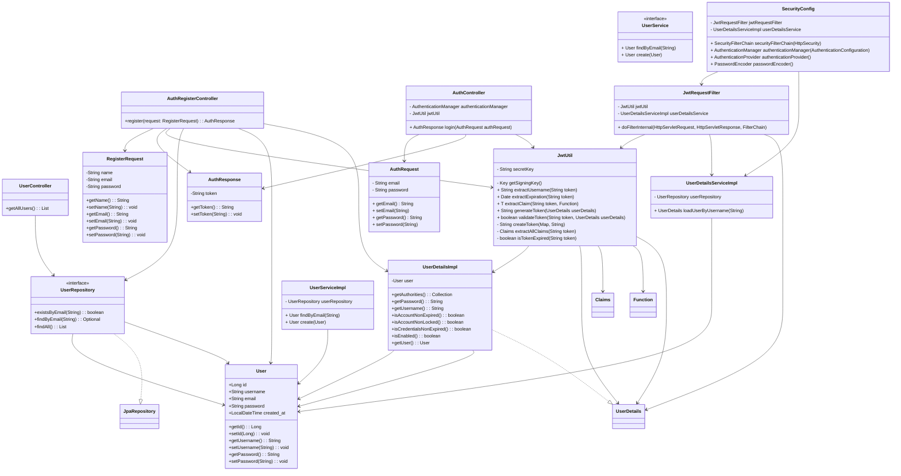

# Service and process management

Web system for monitoring services and processes at all levels, which includes visualization through a kanban board, flow metrics and flows by node (where it is possible to see all of the organization's services).

## Technologies used:
- Back-end: Java, Spring Boot, JWT
- Database: PostgreSQL
- Front-end: Typescript with Angular

## Register / Login funcionality


## Tables
```mermaid
    erDiagram
    users {
        int id PK
        string created_by FK
        string name
        date created_at        
    }

    organization {
        int id PK
        int created_by FK
        string name
        date created_at
    }

    flow {
        int id PK
        int id_organization FK
        int created_by FK
        string name
        string description
        date created_at
    }

    user_permission {
        int id PK
        int id_permission FK
        int id_organization FK
        int id_user FK
        int assigned_by FK
        date created_at
    }

    permissions {
        int id PK
        string type
    }

    cards {
        int id PK
        int id_flow FK
        string name
        string description
        int id_status FK
        int position
        date created_at
        int created_by FK
        date last_update
        int assigned_to FK
    }

    status {
        int id PK
        int id_flow FK
        string name
        int position
    }

    moving {
        int id PK
        int id_card FK
        int moved_to_status FK
        int moved_by FK
        date moved_at
    }  

    organization o{--|| users : "created_by"
    flow o{--|| users : "created_by"
    user_permission ||--|| users : "id_user"
    user_permission ||--|| users : "assigned_by"
    cards o{--|| users : "assigned_to"
    cards ||--|| users : "created_by"
    moving o}--|| users : "moved_by"
    flow o{--|| organization : "id_organization"
    user_permission o{--o{ organization : "id_organization"
    user_permission ||--|| permissions : "id_permission"
    cards o{--|| flow : "id_flow"
    status ||--o{ flow : "id_flow"
    moving ||--|| status : "moved_to_status"
    moving ||--|| cards : "id_card"

```
