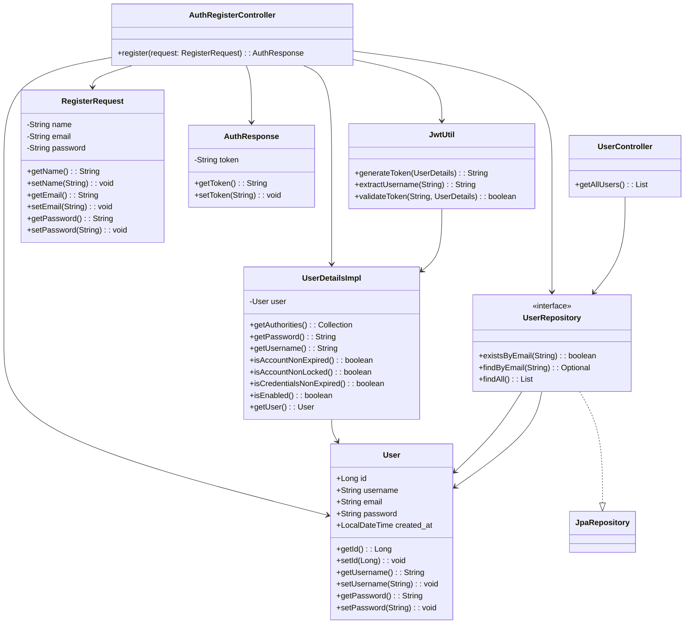

# Service and process management

## Web system for monitoring services and processes at all levels, which includes visualization through a kanban board, flow metrics and flows by node (where it is possible to see all of the organization's services).

### Technologies used:
- Back-end: Java, Spring Boot, JWT
- Database: PostgreSQL
- Front-end: Typescript with Angular

## Register / Login funcionality

